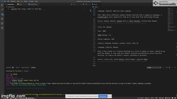

# Liri-Demo

## Liri is like iPhone's Siri. However, while SIRI is a Speech Interpretation and Recognition Interface, LIRI is a Language Interpretation and Recognition Interface. LIRI is a CLI app that takes in parameters and gives you back data.

### Below is a link to the program demonstration of how Liri Works!

## [Liri Bot Demo](https://drive.google.com/file/d/1lV8CxvwBJyhSlpUpPryX9VcIJk0A85T7/view)

* Using spotify-this-song song-name
*LIRI will search Spotify for a song

LIRI will search OMDB for movie titles and information by typing
* movie-this
* movie-name

LIRI will search concert location, date and time using Bands In Town API by typing
* concert-this
* artist-name

LIRI will also read and execute commands in a separate text file by typing
* do-what-it-says

* In Addition, LIRI will log your searched to a text file.